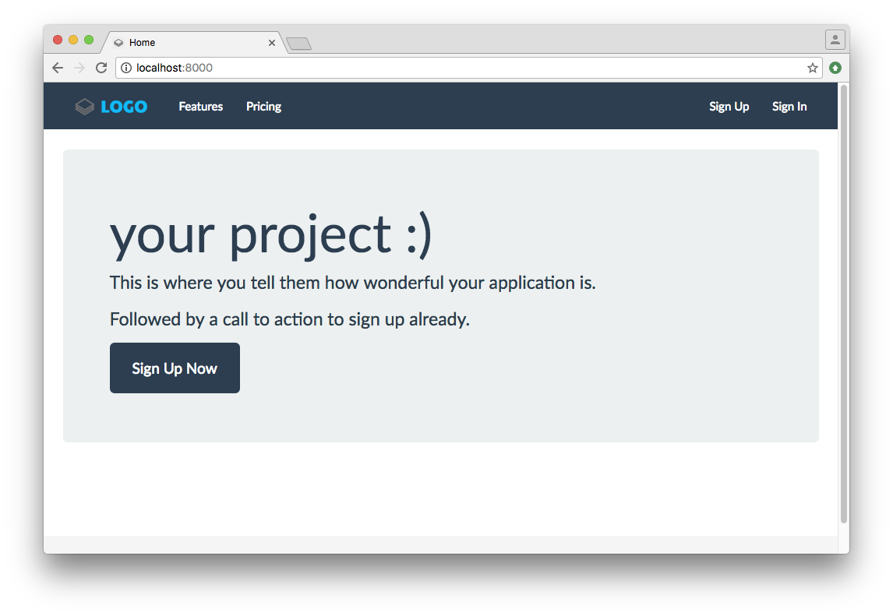

# Developing locally

## Prereqiuisites
Cookiecutter SaaS uses Docker for development and production, make sure Docker and Docker Compose are installed. If you are planning to push your project to production (you should), you'll also need to install Docker Machine.

### On macOS
Follow the [Docker for Mac](https://docs.docker.com/docker-for-mac/) installation instructions. This will install Docker, Docker Compose and Docker Machine on your Mac.

### Windows
Follow the [Docker for Windows](https://docs.docker.com/docker-for-windows/) installation instructions. This will install Docker, Docker Compose and Docker Machine on your Windows machine.

### Linux
First, you need to install the Docker engine, follow the [Docker on Linux](https://docs.docker.com/engine/installation/#/on-linux) installation instructions. Next, you need to [install Docker Compose](https://docs.docker.com/compose/install/) and [install Docker Machine](https://docs.docker.com/machine/install-machine/).

Make sure everything is installed correctly by running:

	docker --version
	docker-compose --version
	docker-machine --version
		
## Running the Project

Before running the project for the first time, you need to build it.

Start the build process with: 

    docker-compose -f dev.yml build

This tells Docker Compose to:

- pull all required base images from Docker Hub
- install all python dependencies via pip (and npm if you are going to using react)
- copy utility scripts into the image
- set up all required environment variables    

This is going to take a while the first time you run it. Subsequent builds will be a lot faster because Docker caches each build step.

While you wait, check out the [Third Party Services](third_party_services.html) section. During development, in order to test subscriptions, we just need the Stripe and Octobat keys to be set. Create an account for both services and copy the keys to `config/settings/local.py`.

Once the build process is completed, run the project with:

	docker-compose -f dev.yml up
	
You should see a lot of log messages flying by as each container is initializing itself. Look at the logs.

	django_1    | Django version 1.10, using settings 'config.settings.local'
	django_1    | Development server is running at http://0.0.0.0:8000/
	django_1    | Using the Werkzeug debugger (http://werkzeug.pocoo.org/)
	django_1    | Quit the server with CONTROL-C.
	django_1    |  * Debugger is active!
	django_1    |  * Debugger pin code: 241-491-852
	
As soon as you see a log similar to this, your project is ready. 
 
Fire up your browser and go to [http://localhost:8000](http://localhost:8000).

If you want, you can now create a super user. Open up a second terminal and run:

	docker-compose -f dev.yml createsuperuser

Now, go ahead and [write your app](write_your_app.html). You might also want to check out the [things to change](things_to_change.html) section sooner or later.
